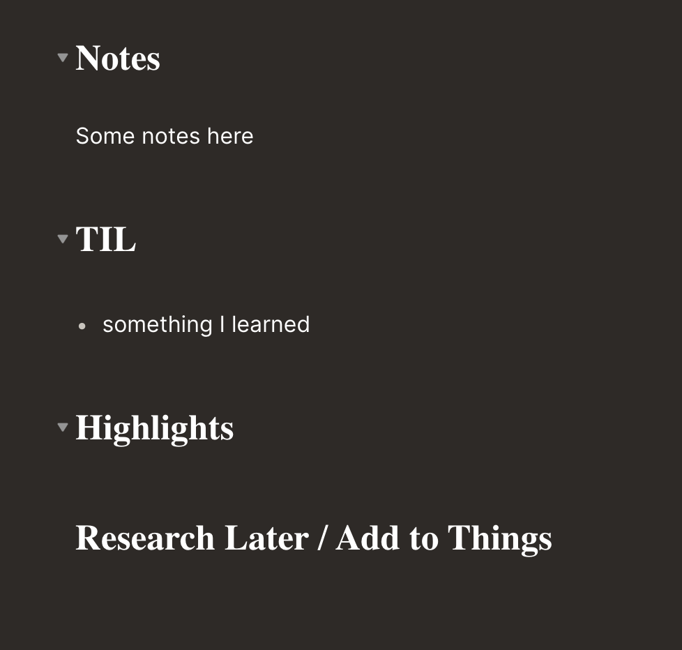

If you're not familiar with the
[bullet journal](https://www.newyorker.com/culture/culture-desk/can-bullet-journaling-save-you),
it's, in essence, a way of combining multiple notebooks into one. A somewhat
freeform planner that's created and customized by the individual.

As someone with ADHD, I find the concept both helpful and overwhelming. It's a
blank notebook, requires work each week/month to set up, and the potential for
artistic expression leaves simple layouts feeling a bit boring to me. At the
same time, I don't want to waste significant time making something complicated.

While we can't wholly replicate this in the digital world with Obsidian, we can
get close to the concept with daily notes.

## Automation saves the day

Quite possibly, the best part of daily notes is they can be created using the
command menu in Obsidian and scaffolded out from a template you can customize to
suit your needs.

> 👆 My daily notes template.

A keyboard shortcut, and I've got a head start. Let's go through the sections.

## Notes

This is where I keep my notes about the tasks I'm working on, research I've
completed, meetings, etc. Fairly self-explanatory, but this is primarily a
free-form section.

## Today I Learned (TIL)

I use this section to jot down quick notes about new things I learn that I may
or may not turn into a whole note in Obsidian. Backlinks make this a lighter
lift allowing me to connect the ideas to a specific day.

## Highlights

Anything of note that is a high point of the day. It could be a compliment,
solving a bug, etc. Not all, but most items noted here end up in my Brag Doc.

## Research Later / Add to Things

These are the items that come up during the day, possibly things I've learned or
thought of that need time I can't devote to that day. This helps keep me on
track with the things I need to get done; sometimes, that's no small feat.
Sometimes I need to add these to a specific day, and those items will get added
to Things, my digital to-do list, with a deadline added to the calendar.

Hopefully, this gives you an idea of how you could structure your daily notes in
Obsidian.
